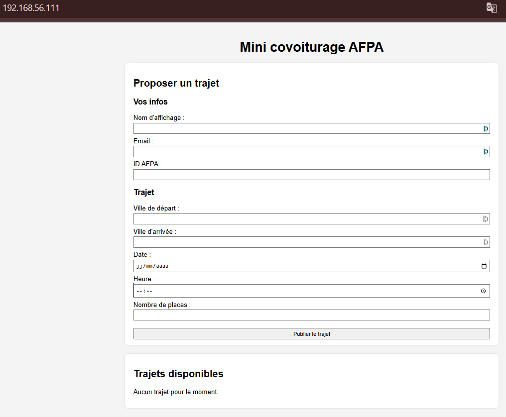

# Automated Deployment (Vagrant & Ansible) of a Web Application


## Introduction

This project automates the deployment of a **Mini Carpooling Web Application** using :

- **Ansible** for configuration management  
- **Vagrant** to provision the virtual environment  
- **Apache2 + PHP** for the web application  
- **MariaDB** for the database  
- **Code source** in the repository "App-Carpooling" : https://github.com/a-grivet/App_Carpooling.git
- **Nftables** as firewall

The deployment follows modern best practices :
- Role-based architecture  
- Layered tagging system  
- Idempotent tasks  
- Separation of concerns (web vs database)  
- Easily extensible infrastructure  

## Architecture Overview

### Web Layer
The web server handles :
- Apache2 + PHP runtime  
- Serving `/var/www/html/`  
- Deploying PHP app (index.php, config.php, style.css)  
- Managing VirtualHost configuration  
- Connecting to database server  

### Database Layer
The DB server handles :
- Installation & configuration of MariaDB  
- Creating database `covoit`  
- Creating user `covoit_user` with limited rights  
- Importing schema from GitHub repo  

## Architecture Overview


## Firewall Rules Summary (nftables)

The infrastructure uses **nftables** for lightweight firewalling.  
Each VM exposes **only the strictly required ports** for operation.

| Server        | Port | Protocol | Direction | Purpose                             | Allowed From        |
|---------------|------|----------|-----------|-------------------------------------|----------------------|
| **Web Server** | 22   | TCP      | Inbound   | SSH access for provisioning          | Control Node (host) |
| **Web Server** | 80   | TCP      | Inbound   | Web application (Apache + PHP)       | Private network      |
| **DB Server**  | 22   | TCP      | Inbound   | SSH access for provisioning          | Control Node (host) |
| **DB Server**  | 3306 | TCP      | Inbound   | MariaDB queries                      | Web Server only      |

### Notes  
- SSH (22) is restricted to the control node only.  
- Only the **Web Server** exposes HTTP (80).  
- The **DB Server** does *not* expose any public-facing ports.  
- MariaDB (`3306`) is reachable only from the Web Server for strict isolation.  
- Outbound traffic is allowed, inbound traffic is strictly filtered.

## Tagging System (Layered Logic)

### Role-Level Tags

| Tag | Meaning |
|-----|---------|
| `common` | Base OS configuration |
| `db` | Database role (MariaDB setup) |
| `web` | Web role (Apache + PHP + app deployment) |
| `firewall` | Firewall / nftables |

### Task-Level Tags

| Tag | Meaning |
|------|---------|
| `bootstrap` | System updates & essential packages |
| `install` | Software installation |
| `config` | Config files, vhost, timezone |
| `vhost` | VirtualHost configuration |
| `deploy-code` | Application code deployment |
| `service` | Service enable/restart |
| `security` | nftables / firewall configuration |

## Tag Usage Examples

### Run only DB tasks
```bash
ansible-playbook -i inventories/vagrant/hosts.yml playbooks/site.yml --tags db
```

### Skip code deployment
```bash
ansible-playbook -i inventories/vagrant/hosts.yml playbooks/site.yml --skip-tags deploy-code
```

### Granular: deploy code only on web
```bash
ansible-playbook -i inventories/vagrant/hosts.yml playbooks/site.yml --tags "web,deploy-code"
```
## Preview 




## References

### Ansible  
- https://docs.ansible.com/ansible/latest/playbook_guide/playbooks_tags.html  

### Vagrant  
- https://developer.hashicorp.com/vagrant/docs 

### MariaDB  
- https://mariadb.com/docs/server/server-management/automated-mariadb-deployment-and-administration/ansible-and-mariadb 

### nftables  
- https://docs.redhat.com/en/documentation/red_hat_enterprise_linux/8/html/configuring_and_managing_networking/getting-started-with-nftables_configuring-and-managing-networking
